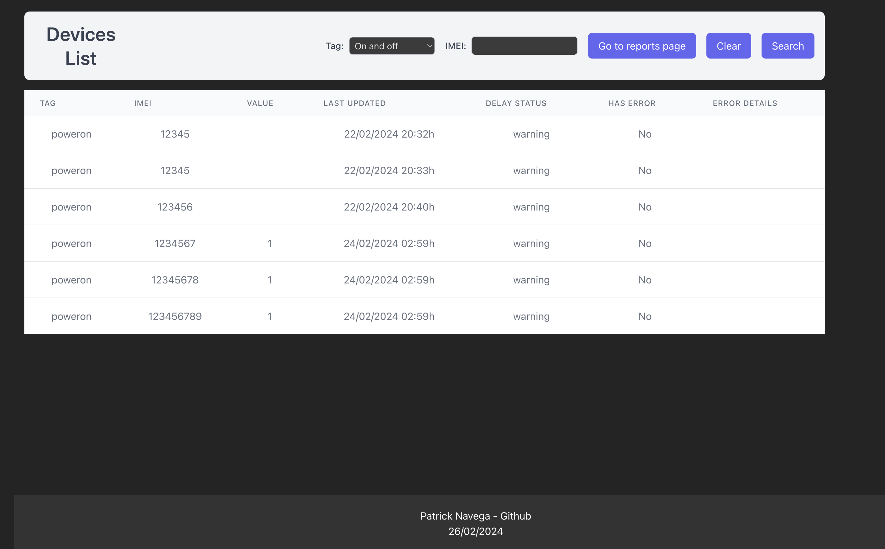
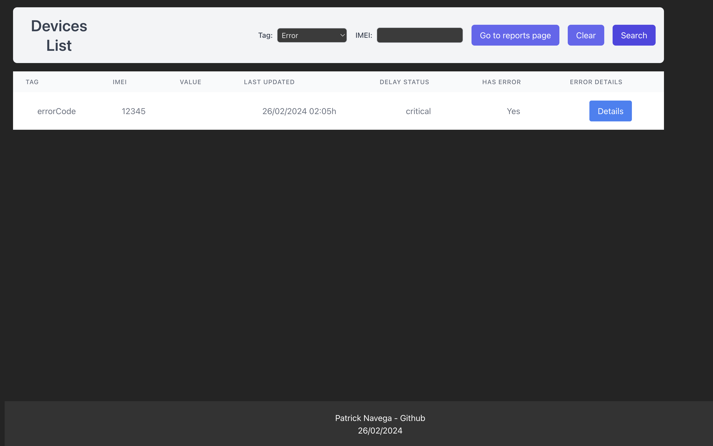
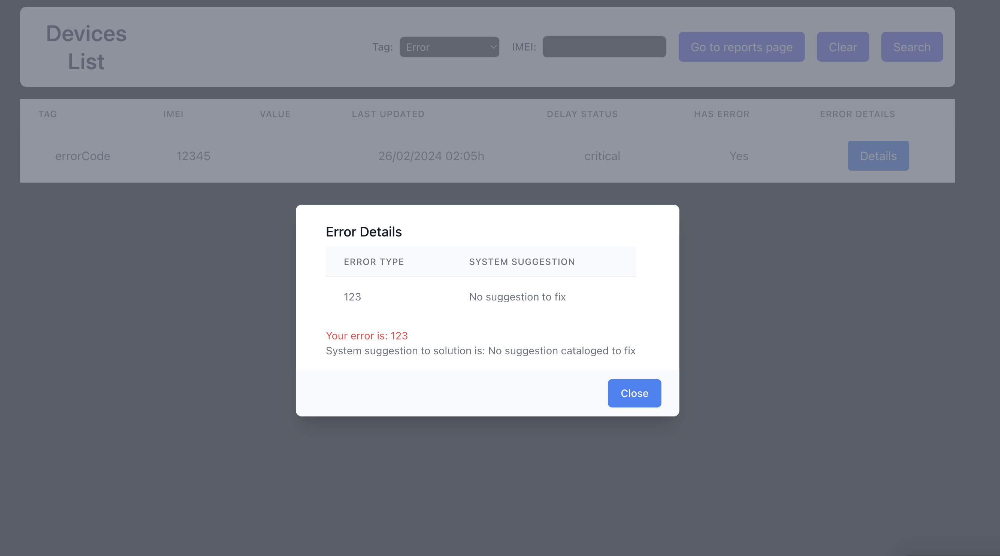
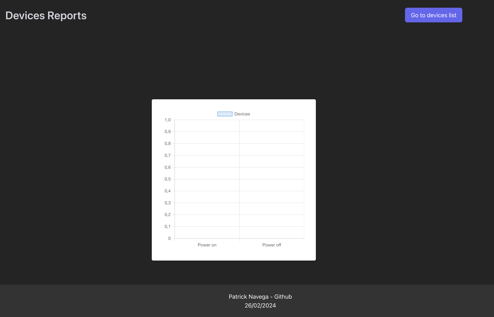

<!DOCTYPE html>
<html lang="en">
<head>
  <meta charset="UTF-8">
  <meta name="viewport" content="width=device-width, initial-scale=1.0">
</head>
<body>
  <h1>Aplicação de controle de dispositivos</h1>
  
  <h2>Introdução</h2>
  
Esta é uma aplicação full stack desenvolvida com Node.js, TypeScript, Express no backend e TypeScript, React e Vite no frontend. MongoDB como banco princial.

  
  <h2>Como Usar</h2>
  
  <h3>1. Iniciar a Aplicação</h3>
  
Para iniciar a aplicação, siga estas etapas:

  <pre><code>docker-compose up</code></pre>
  
A aplicação backend estará disponível em <a href="http://localhost:3001">http://localhost:3001</a> e a aplicação frontend em <a href="http://localhost:5173">http://localhost:5173</a>.

  
  <h3>2. Executar Testes Unitários no Backend</h3>
  
Para executar os testes unitários no backend, siga estas etapas:

  <pre><code>https://github.com/psnavega/device-task.git</code></pre>

  <pre><code>docker ps</code></pre>
  
Encontre o ID do contêiner do backend na lista de contêineres em execução.

  <pre><code>docker exec -it &lt;ID_DO_CONTAINER&gt; npm run test</code></pre>

  <h2>Como navegar pelo front-end</h2>

  <h4>Tela inicial da aplicação</h4>
  

  
Como podem ver, temos uma tabela com 7 colunas, sendo elas:

  <li>
    <ul>IMEI - identificado único do dispositivo</ul>
    <ul>Tag - a tag do status atual ou do último status emitido por aquele aparelho</ul>
    <ul>Valor - Detalhe emitido pelo aparelho</ul>
    <ul>Última atualização - Aponta para o momento em que recebemos o último ping do dispositivo</ul>
    <ul>Status de atraso - Caso o dispositivo não tenha realizado um report a partir dos 30 minutos, assumimos pode estar em falha e nesse caso</ul>
    <li>
      <ul>Intervalo maior que 30 minutos e menor que 24h - Warning</ul>
      <ul>Intervalo maior que maior que 24h - Critical</ul>
    </li>
    <ul>Existe erro - Foi reportado um erro pelo dispositivo?</ul>
    <ul>Detalhes do erro - Essa coluna só estará preenchida quando hasError for verdadeiro, nesse caso teremos um botão habilitado que abri'ra um modal com os detalhes do erro</ul>

  <h4>Busca por erros e botão habilitado para clique</h4>
  

  
O que acontece ao clicar em detalhes?

  
Abrimos um modal com os detalhes de todos os erros catalogados na aplicação, e suas soluções - caso já tenham sido solucionadas

  
Abaixo uma mensagem descrevendo qual o erro do usuário e solução a ser aplicada

  
Nessa versão MVP ainda não possuímos a possibilidade de registrar soluções de erro, contudo, em casos de error ser BAD_CONFIGURATION temos uma mensagem personalizada ao usuário informando para buscar uma assistência técnica.

  

  <h4>Página de relatório - Dispositivos Ligados x Dispositivos Desligados</h4>
  
Essa página nos dá um feedback visual sobre a relação de dispositivos ligados x desligados a partir de um gráfico de colunas/p>
  
  
  <h2>Funcionalidades do backend</h2>
  
  <h3>Rotas Backend</h3>
  
Aqui estão alguns exemplos de uso das rotas do backend:

  
  <h4>Atualizar IOT</h4>
  
<strong>Endpoint:</strong> <code>PATCH /api/v1/iot/:imei</code>

  
<strong>Exemplo de uso:</strong>

  <pre><code>curl -X PATCH -H "Content-Type: application/json" -d '{"tag":"poweron", "value":100}' http://localhost:3001/api/v1/iot/123456789</code></pre>

  
Retorno esperado

  <pre><code>{
    message: 'IOT updated'
}</code></pre>
  
  <h4>Criar IOT</h4>
  
<strong>Endpoint:</strong> <code>POST /api/v1/iot</code>

  
<strong>Exemplo de uso:</strong>

  <pre><code>curl -X POST -H "Content-Type: application/json" -d '{"tag":"poweroff", "imei":"987654321", "value":200}' http://localhost:3001/api/v1/iot</code></pre>
  
  <h4>Listar IOTs</h4>
  
<strong>Endpoint:</strong> <code>GET /api/v1/iots?status=&imei=</code>

  
<strong>Exemplo de uso:</strong>

  <pre><code>curl http://localhost:3001/api/v1/iot?status=on-and-offs&amp;imei=</code></pre>
    <h4>Status aceitos</h4>
  <li>
    <ul>has-reports</ul>
    <ul>has-no-reports</ul>
    <ul>on-and-offs</ul>
    <ul>errors</ul>
  </li>

  
Retorno esperado

  <pre><code>{
    "message": "success",
    "data": [
        {
            "_id": "65d7af56584fab4573af05e3",
            "tag": "poweron",
            "imei": "12345",
            "createdAt": "2024-02-22T20:32:22.201Z",
            "updatedAt": "2024-02-22T20:32:22.201Z",
            "__v": 0
        },
        ...
        {
            "_id": "65d7afb086087c5b4072be55",
            "tag": "poweron",
            "imei": "12345",
            "createdAt": "2024-02-22T20:33:52.083Z",
            "updatedAt": "2024-02-22T20:33:52.083Z",
            "__v": 0
        },
    ]
}</code></pre>

  <h4>Criação de IOT</h4>
  <h4>Exemplo</h4>
  <pre><code>
{
    tag: poweron
    imei: string
    value: 1
}
  </code></pre>

Retorno esperado

<pre><code>
{
  message: "success",
  data: {
    "_id": "65d7afb086087c5b4072be55",
    "tag": "poweron",
    "imei": "12345",
    "createdAt": "2024-02-22T20:33:52.083Z",
    "updatedAt": "2024-02-22T20:33:52.083Z",
    "__v": 0
  }
}
</code></pre>

<h4>Tags aceitas</h4>
  <ul>
    <li>poweron</li>
    <li>poweroff</li>
    <li>timebased</li>
    <li>errorCode</li>
  </ul>

  <h4>Listar erros individualmente</h4>
  
Essa rota cataloga todos os erros registrados nos dispositivos para que sejam renderizados em uma tabela no front-end e, caso queiramos, podemos ampliar a aplicação para que possa ser possível cadastrar sugestões de soluções para cada erro catalogável para que dessa maneira o usuário saiba o que fazer quando se deparar com um erro já conhecido e solucionado.

  <pre><code>
    GET http://localhost:3001/api/v1/iot/errors
  </code></pre>

Retorno esperado

<pre><code>
  {
    "message": "success",
    "data": [
        "MEMORY_FAILURE",
        "BAD_CONFIGURATION"
    ]
  }
  </code></pre>

  <h4>Erros</h4>
  
Todas as rotas retornam um erro com formato padrão contendo a descrição do erro como detalhes e o status no header da requisição.

  
Retorno esperado

  <pre><code>
  {
    "error": true,
    "message": "\"status\" must be one of [has-reports, has-no-reports, on-and-offs, errors]"
  }
  </code></pre>

  
Note que nesse exemplo o status do retorno está como 422, ou seja entidade não processável. Ou seja, é esperado que a aplicação saiba lidar com erros e tratá-los

</body>
</html>
